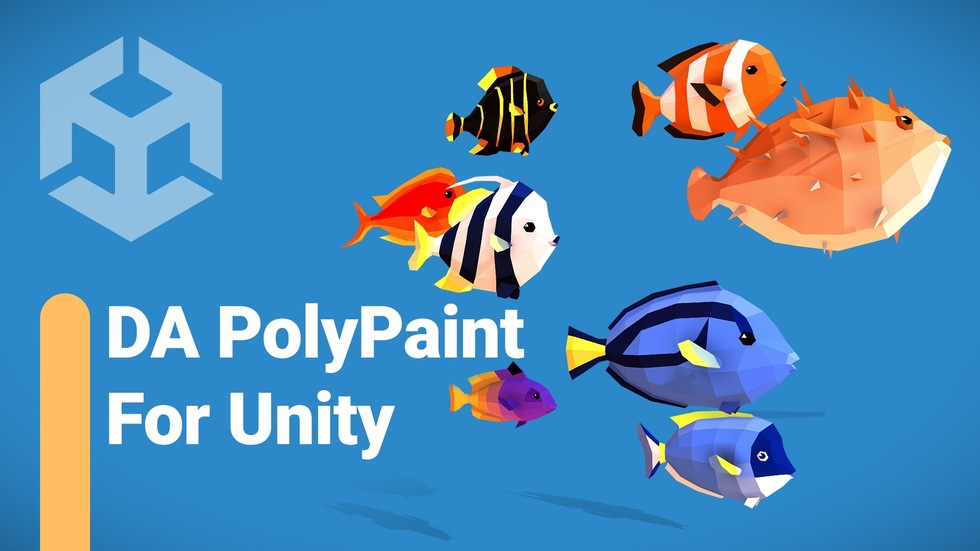
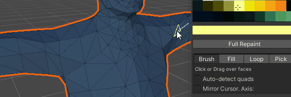
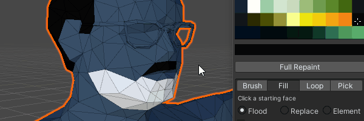
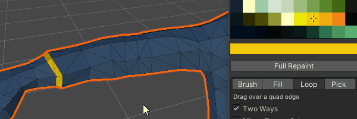
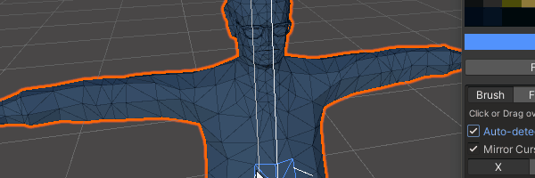

# DA Poly Paint for Unity

- [Introduction](#introduction)
- [Installation](#installation)
- [Using DA Poly Paint](#using-da-poly-paint)
- [Requirements and Compatibility](#requirements-and-compatibility)
- [Keyboard Shortcuts](#keyboard-shortcuts)
- [Additional Notes](#additional-notes)

## Introduction 

[*Watch YouTube Video*](https://www.youtube.com/watch?v=wEDbnaEky0Y)

DA Poly Paint is an easy-to-use Polygon Painting tool for Unity, offering an alternative to [pX Poly Paint for 3ds Max](https://github.com/piXelicidio/pxMaxScript/tree/master/PolyPainter). With DA Poly Paint, you can easily customize your low-poly style models directly within the Unity environment, saving time and effort on traditional UV mapping and texturing tasks.

## Installation from the Unity Store

Get it here: [DA PolyPaint - Low Poly Customizer](https://assetstore.unity.com/packages/tools/painting/da-polypaint-low-poly-customizer-251157)

## Installation (from GitHub) 

1. Download or clone the code from the GitHub repo: https://github.com/piXelicidio/DAPolyPaint
2. Place the downloaded code anywhere inside your Unity project assets.

## Using DA Poly Paint 
### Getting Started
1. Access the tool via the Unity Main Menu: **Tools** > **DA** > **Poly Paint**
2. Select any mesh object in the scene.
3. Click **'START PAINTING'** in the DA Poly Paint window.
4. Select a color by clicking the texture palette box.
5. Click and drag over the surface of your model to start painting with the default tool: Brush.

## Painting

### Brush

Paint individual triangles (Or quads if auto-detect quad is activated).

### Full Repaint

This applies the selected color to the entire model.

### Fill

 
Paint areas with the following modes:
1. Flood: Fill continuous areas of the same color.
2. Replace: Replace all ocurrences of the color for the whole model.
3. Element: Full paint a mesh section (All conected faces).

### Loop

Paint along quad loops. Uncheck "Two Ways" if you want the stroke to go only in the direction of the mouse drag. Note that loop only works if the cursor is over a detected quad, and the mouse drag should cross one of its edges.

### Pick 
This allows you to sample colors directly from the 3D object surface.

### Mirror Cursor Axis

Mirrors the current tool cursor along a selected axis. 

## Utilities
### Remap To Texture
Easily switch between color palettes without disrupting your UV mapping. This feature analyzes a new texture and reassigns UVs to the most similar colors, allowing for seamless transitions between palettes and optimization across multiple models. Ideal for low-poly art creation and texture consolidation.

## Requirements and Compatibility 
- A mesh with a Mesh Filter or Skinned Mesh Renderer component.
- A material with a diffuse texture assigned. (This will act as palette color)

## Keyboard Shortcuts 
- **Ctrl**: Fill
- **Ctrl + Shift**: Loop
- **Shift**: Pick

## Additional Notes 
- When the selection changes, the DA Poly Paint window will indicate if it is ready for painting.
- **WARNING!:** After pressing **START PAINT**, the tool tries to constrain the focus to the selection. Trying to force a change in the currently selected object or using other editor features might conflict with DA Poly Paint. Always click **END SESSION** after finishing painting. Changing the scene could also cause issues. ([issue#9](https://github.com/piXelicidio/DAPolyPaint/issues/9))  
- When modifications are saved, a new mesh asset is created, if necessary. Imported 3D models in FBX or OBJ format cannot be directly modified, so an editable copy is required.

## Fuel DA Poly Paint's Future 🚀 
Digging DA Poly Paint? Keep the colors flowing by snagging my low-poly characters. You get awesome assets, and DA Poly Paint gets to grow - it's a win-win!

Check out: [City People Mega-Pack](https://assetstore.unity.com/packages/3d/characters/city-people-mega-pack-203329)

Your support helps paint a vibrant future for everyone. 🎨🌈

## Help & Support
| [PolyChat forum](https://github.com/piXelicidio/PolyChat/discussions/categories/scripted-tools) | [direct e-mail](mailto:denys.almaral@gmail.com) | 