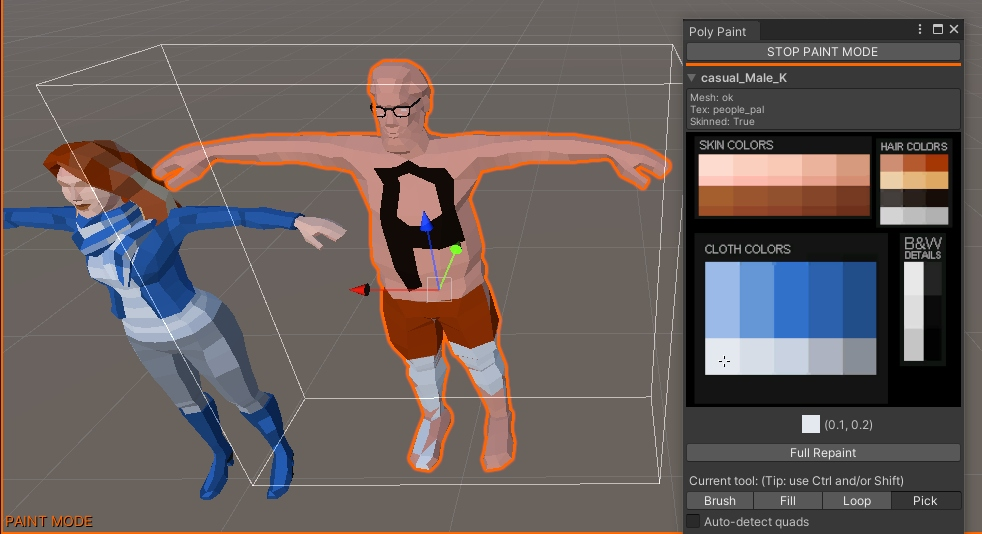

# DAPolyPaint

3D Polygon Painter tool for Unity. Alternative to [pX Poly Paint for 3ds Max](https://github.com/piXelicidio/pxMaxScript/tree/master/PolyPainter)

*Installing:*
- Downlaod or clone this code anywhere inside your Unity project assets.
- Open the tool with Unity Main **Menu > DA-Tools > Poly Paint**
---
*Using:*
- Select any mesh object in the scene. 
- Click **START PAINT MODE** on the Poly Paint window.
- Select any color by clicking the texture box.
- Use **Brush**, **Fill** and **Loop** tools to paint and **Pick** to pick a color direclty from the mesh.

*Keyboard shortcuts:*
- **Ctrl** = Fill
- **Ctrl+Shift** = Loop
- **Shift** = Pick
---
*GameObject requirements:*
- A **Mesh Filter** or **Skinned Mesh Render** component.
- A material with a diffuse texture assigned.
